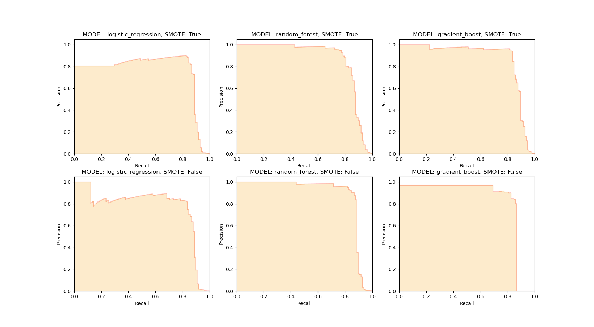

The dataset is highly imbalanced. The class 'fraud' is much less than the class 'not fraud'.

Before SMOTE, the pipeline run on this imbalanced dataset, 
After SMOTE, the pipeline run on augmented dataset generated by SMOTE. In the augment dataset, the class number are equal.

According to the result, the recall will be significantly increased by adopting SMOTE, but the trade-off is the precision becomes lower. This means there is fewer false negative. If the objective of the project is to identify the 'fraud' as many as possible, then SMOTE is prefered

Another finding is that the performance with SMOTE is similar with the performance without SMOTE but with `class_weight = 'balanced'`. 

The logistic regression runs the fastest, the random forest is the second, and the GBDT is the slowest one.  This is because random forest allows the parallel estimation of the trees. But GBDT is essentially a sequential algorithm. One possible solution to speed up is to use stochastic GBDT, which only fits a subset of all features at each iteration.

Results with SMOTE

| Method | Precision| Recall | F1 |
| ----------- | ----------- | ----------- | ----------- |
| Logistic regression | 0.06 | 0.92 | 0.12 |
| Random Forest | 0.68 | 0.99 | 0.8 |
| Gradient Boost | 0.94 | 1 | 0.97 |

Results without SMOTE

| Method | Precision| Recall | F1 |
| ----------- | ----------- | ----------- | ----------- |
| Logistic regression | 0.89 | 0.63 | 0.74 |
| Random Forest | 1 | 0.84 | 0.91 |
| Gradient Boost | 0.89 | 0.74 | 0.8 |

